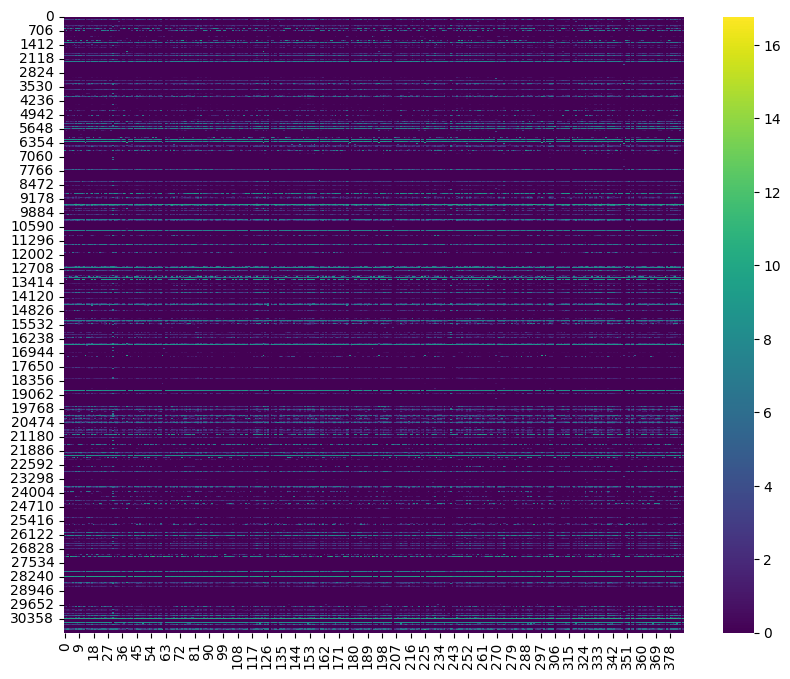
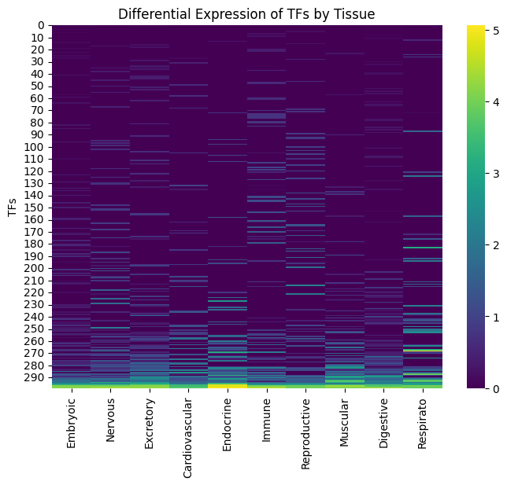

## Introduction

Ectopic expression of proteins can endow cells with new capabilities, such as rendering neurons photosensitive by expressing opsins, which allows for optical control in techniques like optogenetics [1]. Optogenetics, along with related methods such as chemogenetics and sonogenetics, has revolutionized neuroscience and holds great potential for neuromodulatory therapies targeting neurological disorders [2]. The ability to selectively express opsins in specific neuronal cell types can enable precise and efficient optogenetic manipulation.

Current methods introduce ectopic proteins by packaging the gene, along with a promoter, into a viral capsid (e.g., AAV6-hSyn-Chrimson) and delivering it into nervous tissue or the bloodstream. Selective expression of opsins can be achieved by utilizing cell-type specific promoters. However, only a few cell-type specific promoters are small enough to be packaged with AAV [3], and some cell types do not have well-characterized promoter sequences [3].

One key mechanism of gene expression is the activation of promoter sequences by transcription factors. We hypothesize that engineering new transcription factors and smaller promoter sequences activated by those transcription factors could significantly enhance our ability to selectively control cell-type specific expression in neuronal cells.

## Datasets

We focused on mice neuronal cells during the hackathon. To enable generation of cell-type specific promoter sequence and transcription factors we wanted to collect following data. 

1. List of all neuronal cell types
2. Differential expression of genes in all the cell types along with DNA sequence and promoter sequences. Other regulatory DNA sequences. 
3. Transcription factors in mice and their corresponding protein sequences
4. Transcription factors that are known to effect gene expression in neuronal cell types in mice

Obtaining data is required gathering datasets from various studies and databases, and linking them together. We hope this dataset is valuable beyond this hackathon. 

We obtained a list of genes and their RNA-Seq Data from [Allen Brain Map](http://portal.brain-map.org/atlases-and-data/rnaseq), gene expression aggregated per cell type is shown below. 

  

We then used [UCSC Genome Browser]([uniprot.org](https://genome.ucsc.edu/cgi-bin/hgTables)) to obtain all the promoter sequences and the corresponding CDS regions of the gene. All of them are from mm10 as reference. The dataset is available [here](https://drive.google.com/drive/folders/1U3-Ar7Nz6EYM4RUOly1jPoilCHqzOT4k?usp=share_link) 

We utilized [4] to obtain mouse transcription factors by tissue type. And also found differential expression of various TFs in mice by tissue from [4], we selected top N candidates in our computational experiments downstream. 

  

We then used [UniProt](uniprot.org) to obtain all the protein sequences of the transcription factors. The dataset is available [here](https://drive.google.com/drive/folders/1U3-Ar7Nz6EYM4RUOly1jPoilCHqzOT4k?usp=share_link) 

Information about models and designing new TFs can be found on [github][https://github.com/blyncha/evolved24hack/tree/main]

We also utilized PaperQA to obtain information about TFs in neuronal cells in mice in the literature. [5]

| Transcription Factor | Study                        |
|----------------------|-----------------------------|
| CREB                 | Lonze2002Function            |
| CREM                 | Lonze2002Function            |
| ATF-1                | Lonze2002Function            |
| NeuroD1              | Niklison-Chirou2020Regulation |
| Prox1                | Niklison-Chirou2020Regulation |
| Sox3                 | Niklison-Chirou2020Regulation |
| Sox11                | Niklison-Chirou2020Regulation |
| FoxG1                | Niklison-Chirou2020Regulation |
| p53                  | Niklison-Chirou2020Regulation |
| p63                  | Niklison-Chirou2020Regulation |
| p73                  | Niklison-Chirou2020Regulation |
| Sox2                 | Niklison-Chirou2020Regulation |
| Pax6                 | Niklison-Chirou2020Regulation |
| Ngn2                 | Niklison-Chirou2020Regulation |
| REST/NRSF            | Niklison-Chirou2020Regulation |
| NF-κB                | Engelmann2016Transcriptional |
| Runx1                | Inoue2008Runx                |
| Runx3                | Inoue2008Runx                |

## References

1 Deisseroth, K. Optogenetics: 10 years of microbial opsins in neuroscience. Nat Neurosci 18, 1213–1225 (2015). https://doi.org/10.1038/nn.4091

2 Song J, Patel RV, Sharif M, Ashokan A, Michaelides M. Chemogenetics as a neuromodulatory approach to treating neuropsychiatric diseases and disorders. Mol Ther. 2022 Mar 2;30(3):990-1005. doi: 10.1016/j.ymthe.2021.11.019. Epub 2021 Dec 1. PMID: 34861415; PMCID: PMC8899595.

3 Reddy AJ, Geng X, Herschl MH, Kolli S, Kumar A, Hsu PD, Levine S, Ioannidis NM. Designing Cell-Type-Specific Promoter Sequences Using Conservative Model-Based Optimization. bioRxiv [Preprint]. 2024 Jun 23:2024.06.23.600232. doi: 10.1101/2024.06.23.600232. PMID: 38948874; PMCID: PMC11213138.

4 Zhou, Q., Liu, M., Xia, X. et al. A mouse tissue transcription factor atlas. Nat Commun 8, 15089 (2017). https://doi.org/10.1038/ncomms15089

5 Skarlinski, M. D., Cox, S., Laurent, J. M., Braza, J. D., Hinks, M., Hammerling, M. J., Ponnapati, M., Rodriques, S. G., & White, A. D. (2024). Language agents achieve superhuman synthesis of scientific knowledge. arXiv preprint arXiv:2409.13740. https://doi.org/10.48550/arXiv.2409.13740.
